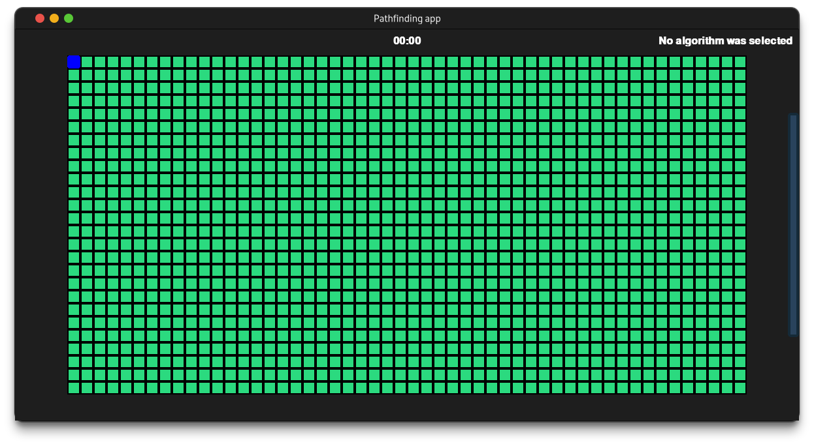

# python-pathfinding

<center>
    <figure>
        
    </figure>
</center>

This project is a simple demonstration on how to implement the A* algorithm in
Python using pygame.

## Requirements

* python>=3.7

## Installing the project and running the project

### Linux

Due to some [settings regarding Python packages management](https://discuss.python.org/t/pep-668-marking-python-base-environments-as-externally-managed/10302/16)
, it's not possible installing the application package without the risk of conflicting packages. Thus, it's recommended that **pipx** is installed before installing the application.

```sh
sudo apt install pipx # If you're in debian based systems. Use your system's package manager!!!
```

After that, you can safely execute the application without worrying about conflicting packages. Go to the project's root directory and execute this command.

```sh
pipx install .
```

Then run

```sh
moura-pathfinding
```

Running that command should lead you to the application where you can see 
pathfinding working.

## Licence

[MIT Licence](./LICENSE)
